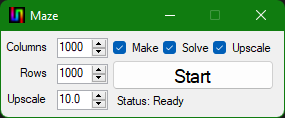

# Maze

Maze generator and solver that use backtracking.

## How to Use

### Maze Generator

```cs
MazeGenerator mazeGenerator = new MazeGenerator(new Size(100, 100));
mazeGenerator.Generate();
mazeGenerator.SaveAsImage("maze.bmp");
```

### Maze Solver

```cs
MazeSolver mazeSolver = new MazeSolver("maze.bmp");
mazeSolver.Solve();
mazeSolver.SaveSolutionAsImage("solution.bmp");
```

## Screenshots

### Form



### Generated Maze


### Solved Maze


